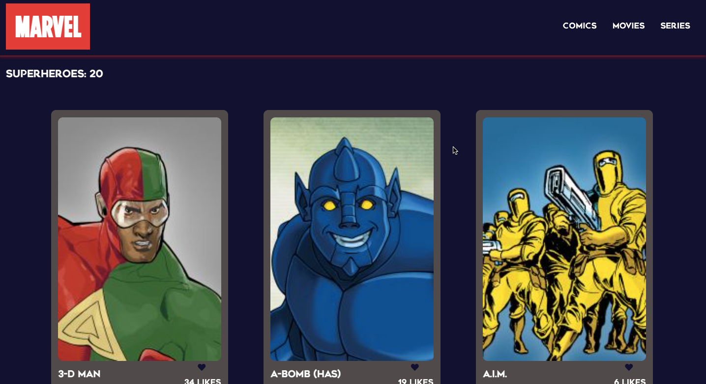

# Marvel's Characters

> Here you can find some of Marvel's characters, write a comment, like them or even book a rescue!

## Description

- This project was developed by a team of three people, here every one of us code a single section, we follow git-flow to build the whole project and sometimes we solved conflicts to merge our pull request to the dev branch. This project is working with two APIs one to get the info about the characters and the second one to post comments, reservations and even likes for your favourite ones.

## Built With

- JavaScript
- Webpack
- HTML/CSS
- Linters

## Live Demo

[Live Demo Link](https://alexrs90.github.io/javascript-capstone/dist)

### Setup Locally
- Open your terminal and run the following command: <code>git clone https://github.com/AlexRS90/javascript-capstone.git</code>
- Run the command <code>cd javascript-capstone</code>
- Run the command <code>npm install</code>
- Run the command <code>npm run build</code>
- Run the command <code>npm run start</code>

Once you completed this steps you should see the app running at: http://localhost:8080/ in your browser.

## Authors

👤 **Abel Herrera**

- GitHub: [@Lino09](https://github.com/Lino09)
- Twitter: [@AbelHerreraZam1](https://twitter.com/AbelHerreraZam1)
- LinkedIn: [@abelherrarz](https://linkedin.com/in/abelherreraz)

👤 **Jim Ntare**

- GitHub: [@Ntare22](https://github.com/Ntare22)
- Twitter: [@JimNtare](https://twitter.com/JimNtare)
- LinkedIn: [@jimntare](https://www.linkedin.com/in/jimntare/)

👤 **Alejandro Ramos**

- GitHub: [@AlexRS90](https://github.com/AlexRS90)
- Twitter: [@AlejandroRBenji](https://twitter.com/AlejandroRBenji)
- LinkedIn: [@alejandro-ramos-santos-9b0b52135](https://www.linkedin.com/in/alejandro-ramos-santos-9b0b52135/)

## 🤝 Contributing

Contributions, issues, and feature requests are welcome!

Feel free to check the [issues page](https://github.com/AlexRS90/javascript-capstone/issues).

## Show your support

Give a ⭐️ if you like this project!

## Acknowledgments

- Hat tip to anyone whose code was used
- Inspiration
- etc

## 📝 License

This project is [MIT](./MIT.md) licensed.
